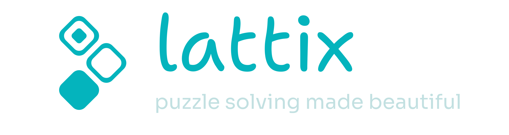

---

***lattix*** is a lightweight web (and now desktop!) application for editing and solving gridded puzzles of any kind.

You know what I’m talking about – Sudokus, [Skyscrapers](https://sup2point0.github.io/skyscraping), anything that uses a grid!

Solving puzzles with pen and paper is an experience, but sometimes you just need a digital version where you can easily edit stuff, make temporary notes and undo mistakes. *lattix* is just that – it’s a feature-rich workspace with all the conveniences you need.

Visit [sup2point0.github.io/lattix](https://sup2point0.github.io/lattix) to use it in your web browser, or download the Windows installer at [Releases](https://github.com/Sup2point0/lattix/releases)!

 

## Features

- Multi-select, drag-to-select
- Keyboard navigation and shortcuts
- Cell pencilmarking and highlighting
- Grid randomisation and transformations
- Clean, straightforward UI
- Smooth, painless UX
- Plentiful customisability

 

## About

Built with [Svelte 5](https://svelte.dev) + [SvelteKit](https://svelte.dev/docs/kit).

### Generate AI
All handcoded <3

 

## Contribute

Just a personal project so no need for contributions, but if you have a bug report or feature request, just drop it in [Issues](https://github.com/Sup2point0/lattix/issues)!
